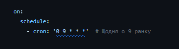
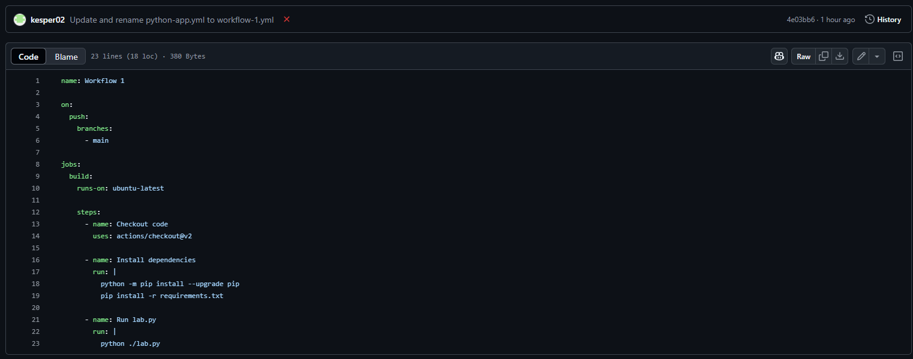
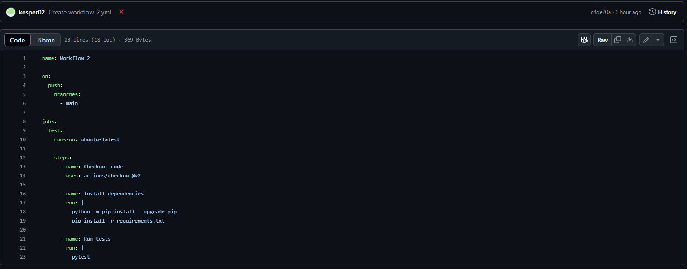
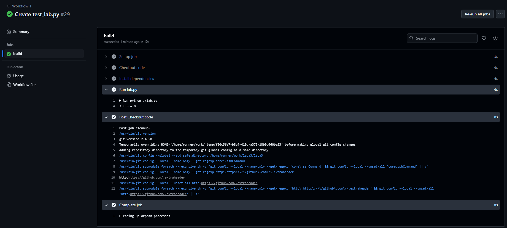
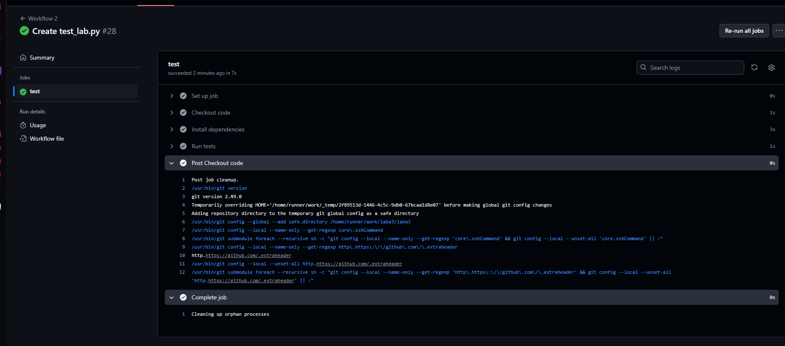
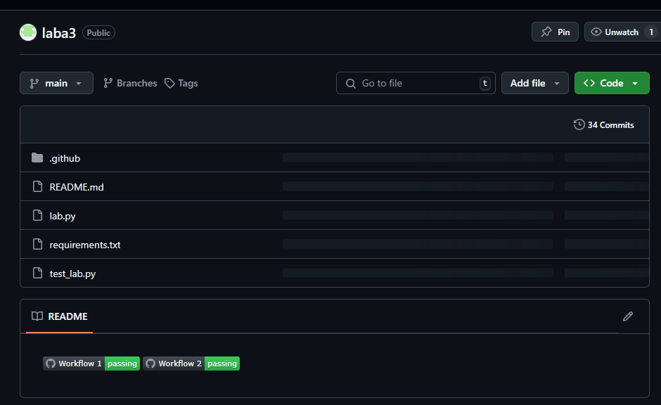

# Звіт до роботи

## Тема:
Автоматизація тестування Python-коду з використанням GitHub Actions

## Мета роботи:
Ознайомитись з GitHub Actions та створити CI/CD Workflow для автоматичного тестування коду та отримання звіту про покриття тестами.

---

## Виконання роботи

### Завдання 1: Створення Workflow через шаблон
- Створено Workflow на основі шаблону Python application
- Додано крок для запуску `lab.py`

### Завдання 2: Запуск вручну та за розкладом
- Додано `workflow_dispatch` для ручного запуску
- Додано `cron`-тригер на вибраний день тижня о 17:00

```yaml
on:
  schedule:
    - cron: '0 9 * * * '  # щодня о 9
```

### Завдання 3: Два окремих файли Workflow
- Створено два окремих файли у папці `.github/workflows/`:

```
.github/
└── workflows/
    ├── workflow1.yml
    └── workflow2.yml
```

#### Вміст `workflow1.yml`:
```yaml
name: Workflow 1

on:
  push:
    branches:
      - main

jobs:
  build:
    runs-on: ubuntu-latest

    steps:
      - name: Checkout code
        uses: actions/checkout@v2

      - name: Install dependencies
        run: |
          python -m pip install --upgrade pip
          pip install -r requirements.txt

      - name: Run lab.py
        run: |
          python ./lab.py
```

#### Вміст `workflow2.yml`:
```yaml
name: Workflow 2

on:
  push:
    branches:
      - main

jobs:
  test:
    runs-on: ubuntu-latest

    steps:
      - name: Checkout code
        uses: actions/checkout@v2

      - name: Install dependencies
        run: |
          python -m pip install --upgrade pip
          pip install -r requirements.txt

      - name: Run tests
        run: |
          pytest
```

### Завдання 4: Код проєкту

#### `lab.py`
```python
def add(a, b):
    return a + b

def subtract(a, b):
    return a - b

if __name__ == "__main__":
    result = add(3, 5)
    print(f"3 + 5 = {result}")
```

#### `test_lab.py`
```python
from lab import add, subtract

def test_add():
    assert add(3, 5) == 8

def test_subtract():
    assert subtract(5, 3) == 2
```

### Завдання 5: Два jobs у одному Workflow
```yaml
Перевірка роботи yaml
```



### Баджі зі статусами Workflow

[](https://github.com/kesper02/laba3/actions/workflows/workflow-1.yml)
[](https://github.com/kesper02/laba3/actions/workflows/workflow-2.yml)


### Тестування та звіт покриття
- Встановлено `pytest` та `coverage`
- Створено крок для створення тестового звіту
- Завантажено звіт на codecov.io
- Додано badge із codecov

---

## Висновок:
- Що зроблено: створено GitHub Actions CI/CD, два окремих Workflow, автоматичне тестування коду, інтеграція з Codecov
- Чи досягнуто мети: так
- Які нові знання: створення й модифікація Workflow, робота з тестами й покриттям
- Чи виникли складнощі: були помилки з виконанням pytest та інсталяцією залежностей
- Чи сподобався формат: так
- Побажання: додати приклади з використанням secrets, artifacts, release-циклів

